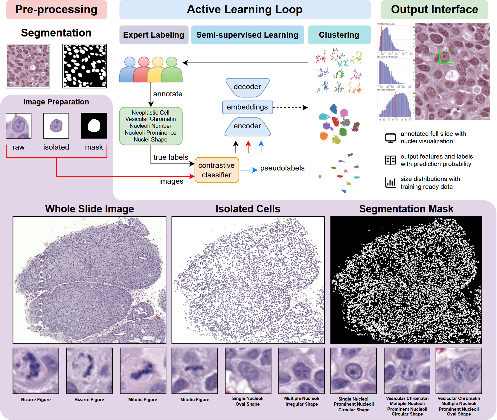
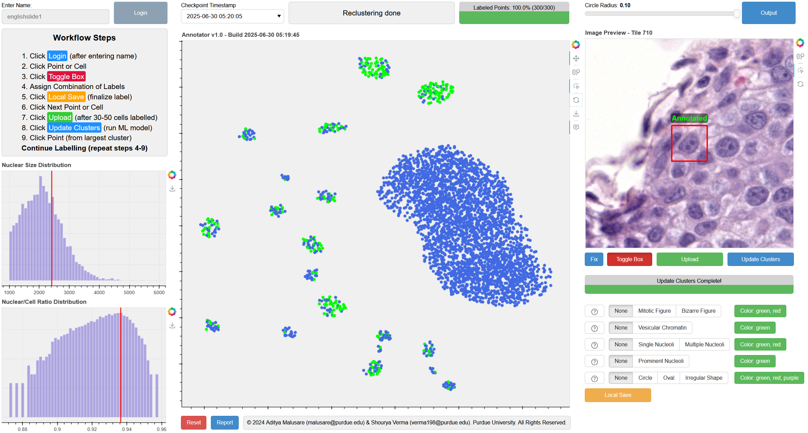
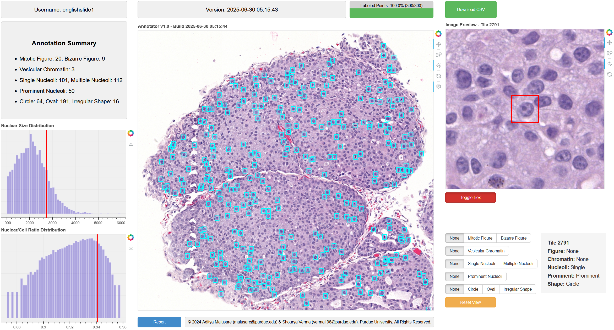

# AnnotateAnyCell

Open-source semi-supervised deep learning framework for efficient annotation and analysis of whole slide images in digital pathology.

[](https://www.biorxiv.org/content/10.1101/2025.11.02.686114v1)
[](LICENSE)

---

## Overview

AnnotateAnyCell is an intelligent interactive web-based platform that enables rapid annotation of cellular structures in histopathological images. The framework integrates active contrastive learning with dimensionality reduction techniques to facilitate efficient exploration and labeling of cells at scale.



**Key Capabilities:**
- Interactive annotation in learned embedding space using UMAP visualization
- Active learning mechanism that improves with human-in-the-loop feedback
- Multi-modal cellular representation (raw patches, isolated regions, semantic masks)
- Real-time model retraining with live progress updates
- Quantitative feature extraction and analysis at cellular resolution

## Interface

### Annotation Workspace



The annotation interface features three coordinated panels:
- **Left:** Workflow guide with nuclear size and N/C ratio distributions
- **Center:** Interactive UMAP embedding where cells cluster by morphological similarity
- **Right:** High-resolution cell preview with morphological annotation controls

### Results and Analysis



The output interface provides:
- Annotation summary statistics and distribution analysis
- Whole slide visualization with spatial location markers
- Individual cell inspection and detailed morphological classifications
- CSV export for downstream computational analysis

---

## Applications

- Accelerated annotation of large-scale histopathological datasets
- Cancer biology research requiring cellular phenotype quantification
- Personalized medicine studies analyzing tissue heterogeneity
- Clinical pathology workflows for diagnostic feature extraction

---

## Code Release

**Status:** Code and demo will be available upon paper acceptance.

The repository will include:
- Complete annotation framework implementation
- Preprocessing and segmentation pipelines
- Active learning and embedding generation modules
- Web interface and visualization tools
- Documentation and usage examples

---

## Citation

If you use AnnotateAnyCell in your research, please cite:

```bibtex
@article{verma2025annotateanycell,
  title={AnnotateAnyCell: Open-Source AI Framework for Efficient Annotation in Digital Pathology},
  author={Verma, Shourya and Malusare, Aditya and Wang, Mengbo and Wang, Luopin and Mahapatra, Arpan and English, Abigail Leigh and Cox, Abigail D and Broman, Meaghan and de Brot, Simone and Burcham, Grant and others},
  journal={bioRxiv},
  year={2025},
  publisher={Cold Spring Harbor Laboratory}
}
```

---

## Contact

For questions or collaboration inquiries, please open an issue or contact the authors.

---

## License

This project will be released under the MIT License.
